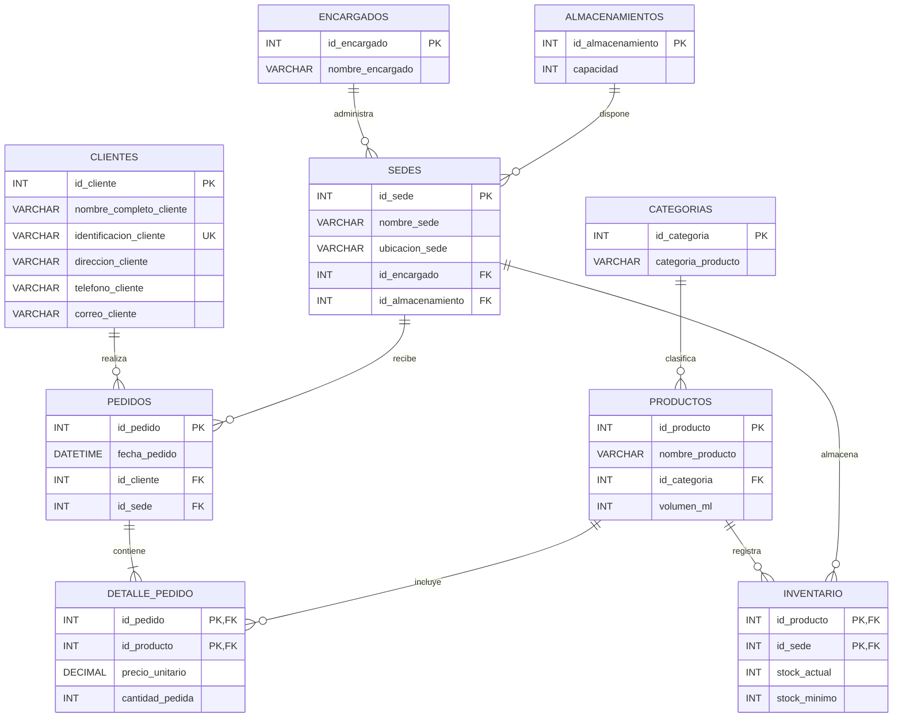

# Requerimientos y análisis de entidades

## 1. Descripción general

El sistema **Distribuidora** representa la gestión de clientes, productos, categorías, pedidos, sedes e inventario.

El modelo parte de una relación inicial que concentraba información de diferentes entidades. Mediante el proceso de normalización se separaron los datos hasta obtener un modelo en **Tercera Forma Normal (3FN)**.

El diseño utiliza claves primarias y foráneas para relacionar las entidades y reducir la duplicación de información.

---

## 2. Entidades del sistema

### Tabla: `clientes`

Almacena la información de los clientes.

| Campo                     | Tipo de dato | Restricciones | Descripción                      |
| ------------------------- | ------------ | ------------- | -------------------------------- |
| `id_cliente`              | INT          | PK            | Identificador único del cliente. |
| `nombre_completo_cliente` | VARCHAR(150) | NOT NULL      | Nombre completo del cliente.     |
| `identificacion_cliente`  | VARCHAR(30)  | UNIQUE        | Identificación del cliente.      |
| `direccion_cliente`       | VARCHAR(200) | NOT NULL      | Dirección del cliente.           |
| `telefono_cliente`        | VARCHAR(30)  | NOT NULL      | Teléfono del cliente.            |
| `correo_cliente`          | VARCHAR(150) | NOT NULL      | Correo electrónico del cliente.  |

### Tabla: `categorias`

Define las categorías de los productos.

| Campo                | Tipo de dato | Restricciones | Descripción                          |
| -------------------- | ------------ | ------------- | ------------------------------------ |
| `id_categoria`       | INT          | PK            | Identificador único de la categoría. |
| `categoria_producto` | VARCHAR(100) | NOT NULL      | Nombre de la categoría.              |

### Tabla: `productos`

Contiene la información propia de cada producto.

| Campo             | Tipo de dato | Restricciones | Descripción                         |
| ----------------- | ------------ | ------------- | ----------------------------------- |
| `id_producto`     | INT          | PK            | Identificador único del producto.   |
| `nombre_producto` | VARCHAR(150) | NOT NULL      | Nombre del producto.                |
| `id_categoria`    | INT          | FK            | Categoría del producto.             |
| `volumen_ml`      | INT          | NOT NULL      | Volumen del producto en mililitros. |

### Tabla: `encargados`

Registra los encargados de las sedes.

| Campo              | Tipo de dato | Restricciones | Descripción                        |
| ------------------ | ------------ | ------------- | ---------------------------------- |
| `id_encargado`     | INT          | PK            | Identificador único del encargado. |
| `nombre_encargado` | VARCHAR(150) | NOT NULL      | Nombre del encargado.              |

### Tabla: `almacenamientos`

Registra la capacidad de almacenamiento asociada a las sedes.

| Campo               | Tipo de dato | Restricciones | Descripción                       |
| ------------------- | ------------ | ------------- | --------------------------------- |
| `id_almacenamiento` | INT          | PK            | Identificador del almacenamiento. |
| `capacidad`         | INT          | NOT NULL      | Capacidad disponible.             |

### Tabla: `sedes`

Representa las sedes de la distribuidora.

| Campo               | Tipo de dato | Restricciones | Descripción                     |
| ------------------- | ------------ | ------------- | ------------------------------- |
| `id_sede`           | INT          | PK            | Identificador único de la sede. |
| `nombre_sede`       | VARCHAR(100) | NOT NULL      | Nombre de la sede.              |
| `ubicacion_sede`    | VARCHAR(200) | NOT NULL      | Ubicación de la sede.           |
| `id_encargado`      | INT          | FK            | Encargado de la sede.           |
| `id_almacenamiento` | INT          | FK            | Almacenamiento de la sede.      |

### Tabla: `inventario`

Relaciona los productos con las sedes y controla las existencias.

| Campo          | Tipo de dato | Restricciones | Descripción                          |
| -------------- | ------------ | ------------- | ------------------------------------ |
| `id_producto`  | INT          | PK, FK        | Producto almacenado.                 |
| `id_sede`      | INT          | PK, FK        | Sede donde se encuentra el producto. |
| `stock_actual` | INT          | NOT NULL      | Existencia actual.                   |
| `stock_minimo` | INT          | NOT NULL      | Existencia mínima establecida.       |

La clave primaria es compuesta:

```text
id_producto + id_sede
```

### Tabla: `pedidos`

Representa la información general de cada pedido.

| Campo          | Tipo de dato | Restricciones | Descripción                     |
| -------------- | ------------ | ------------- | ------------------------------- |
| `id_pedido`    | INT          | PK            | Identificador único del pedido. |
| `fecha_pedido` | DATETIME     | NOT NULL      | Fecha y hora del pedido.        |
| `id_cliente`   | INT          | FK            | Cliente que realiza el pedido.  |
| `id_sede`      | INT          | FK            | Sede asociada al pedido.        |

> Los productos, cantidades, precios y subtotales no se almacenan directamente en esta tabla porque corresponden al detalle del pedido.

### Tabla: `detalle_pedido`

Representa los productos incluidos en cada pedido.

| Campo             | Tipo de dato  | Restricciones | Descripción                         |
| ----------------- | ------------- | ------------- | ----------------------------------- |
| `id_pedido`       | INT           | PK, FK        | Pedido al que pertenece el detalle. |
| `id_producto`     | INT           | PK, FK        | Producto incluido en el pedido.     |
| `precio_unitario` | DECIMAL(10,2) | NOT NULL      | Precio aplicado al producto.        |
| `cantidad_pedida` | INT           | NOT NULL      | Cantidad solicitada.                |

La clave primaria es compuesta:

```text
id_pedido + id_producto
```

---

## 3. Relaciones

| Tabla padre       | Tabla hija       | Cardinalidad | Clave foránea                |
| ----------------- | ---------------- | ------------ | ---------------------------- |
| `clientes`        | `pedidos`        | 1 : N        | `pedidos.id_cliente`         |
| `sedes`           | `pedidos`        | 1 : N        | `pedidos.id_sede`            |
| `pedidos`         | `detalle_pedido` | 1 : N        | `detalle_pedido.id_pedido`   |
| `productos`       | `detalle_pedido` | 1 : N        | `detalle_pedido.id_producto` |
| `categorias`      | `productos`      | 1 : N        | `productos.id_categoria`     |
| `productos`       | `inventario`     | 1 : N        | `inventario.id_producto`     |
| `sedes`           | `inventario`     | 1 : N        | `inventario.id_sede`         |
| `encargados`      | `sedes`          | 1 : N        | `sedes.id_encargado`         |
| `almacenamientos` | `sedes`          | 1 : N        | `sedes.id_almacenamiento`    |

---

## 4. Diagrama del modelo normalizado



---

## 5. Normalización

### Primera Forma Normal (1FN)

La relación inicial contenía información de clientes, productos, pedidos, sedes e inventario en una misma estructura.

Los datos se identificaron y organizaron en valores individuales para poder separar posteriormente las entidades.

### Segunda Forma Normal (2FN)

Se eliminaron las dependencias parciales.

Los datos propios de productos, clientes, categorías, sedes y demás entidades fueron separados de los datos que dependen de combinaciones de claves.

El caso principal es `detalle_pedido`, donde los datos de la línea dependen de:

```text
id_pedido + id_producto
```

### Tercera Forma Normal (3FN)

Se eliminaron las dependencias transitivas.

Por ejemplo, el nombre de una categoría no se almacena dentro de `productos`. En su lugar:

```text
productos
    └── id_categoria

categorias
    └── categoria_producto
```

De igual manera, el stock se mantiene en `inventario` porque depende de:

```text
id_producto + id_sede
```

---

## 6. Campos separados durante la normalización

La tabla original de pedidos contenía información perteneciente a diferentes entidades.

Los campos se distribuyeron de la siguiente manera:

| Campo original         | Tabla normalizada |
| ---------------------- | ----------------- |
| `id_pedido`            | `pedidos`         |
| `id_cliente`           | `pedidos`         |
| `id_sede`              | `pedidos`         |
| `id_producto`          | `detalle_pedido`  |
| `detalles_pedido`      | `detalle_pedido`  |
| `precio_unitario`      | `detalle_pedido`  |
| `cantidad_pedida`      | `detalle_pedido`  |
| `stock_actual`         | `inventario`      |
| `stock_minimo`         | `inventario`      |
| `subtotal_linea`       | Calculado         |
| `total_pedido_sin_iva` | Calculado         |

Esta separación evita almacenar en `pedidos` información que realmente depende del producto, de la sede o de una línea específica del pedido.

---

## 7. Valores calculados

No se almacenan directamente los valores que pueden obtenerse mediante operaciones sobre los datos existentes.

El subtotal de una línea puede calcularse como:

```text
subtotal_linea =
precio_unitario * cantidad_pedida
```

El total del pedido puede obtenerse mediante la suma de los subtotales:

```text
total_pedido_sin_iva =
SUM(subtotal_linea)
```

De esta forma se evita duplicar información derivada.

---

## 8. Reglas principales

* Todos los identificadores utilizan `INT`.
* Las claves foráneas utilizan el mismo tipo que las claves primarias relacionadas.
* `identificacion_cliente` debe ser única.
* Cada producto pertenece a una categoría.
* Cada pedido pertenece a un cliente y a una sede.
* Cada pedido puede contener múltiples productos mediante `detalle_pedido`.
* Un producto puede encontrarse en diferentes sedes mediante `inventario`.
* El inventario se identifica mediante `id_producto + id_sede`.
* El stock no pertenece a `pedidos`.
* Los datos del cliente no se repiten en cada pedido.
* Los datos del producto no se repiten en cada línea mediante información descriptiva.
* El precio unitario se conserva en `detalle_pedido` porque corresponde al precio aplicado en ese pedido.
* Los subtotales y totales pueden calcularse a partir de los datos almacenados.

---

## 9. Tipos de datos principales

### Identificadores

```sql
INT
```

Utilizado para claves primarias y foráneas.

No se utilizan identificadores como:

```text
CLI-001
PROD-101
PED-001
SED-01
```

como claves físicas de la base de datos.

### Valores monetarios

```sql
DECIMAL(10,2)
```

Utilizado para `precio_unitario`.

### Valores numéricos

```sql
INT
```

Utilizado para cantidades, volumen, capacidad y existencias.

### Texto

```sql
VARCHAR
```

Utilizado para nombres, direcciones, correos e información descriptiva.

### Fecha

```sql
DATETIME
```

Utilizado para registrar la fecha y hora de los pedidos.

---

## 10. Resultado final

El modelo normalizado está compuesto por:

```text
clientes
categorias
productos
encargados
almacenamientos
sedes
inventario
pedidos
detalle_pedido
```

La separación de estas entidades permite mantener la información organizada mediante claves primarias y foráneas, reduciendo la redundancia y evitando dependencias parciales y transitivas.

El resultado cumple conceptualmente con la **Tercera Forma Normal (3FN)**.
