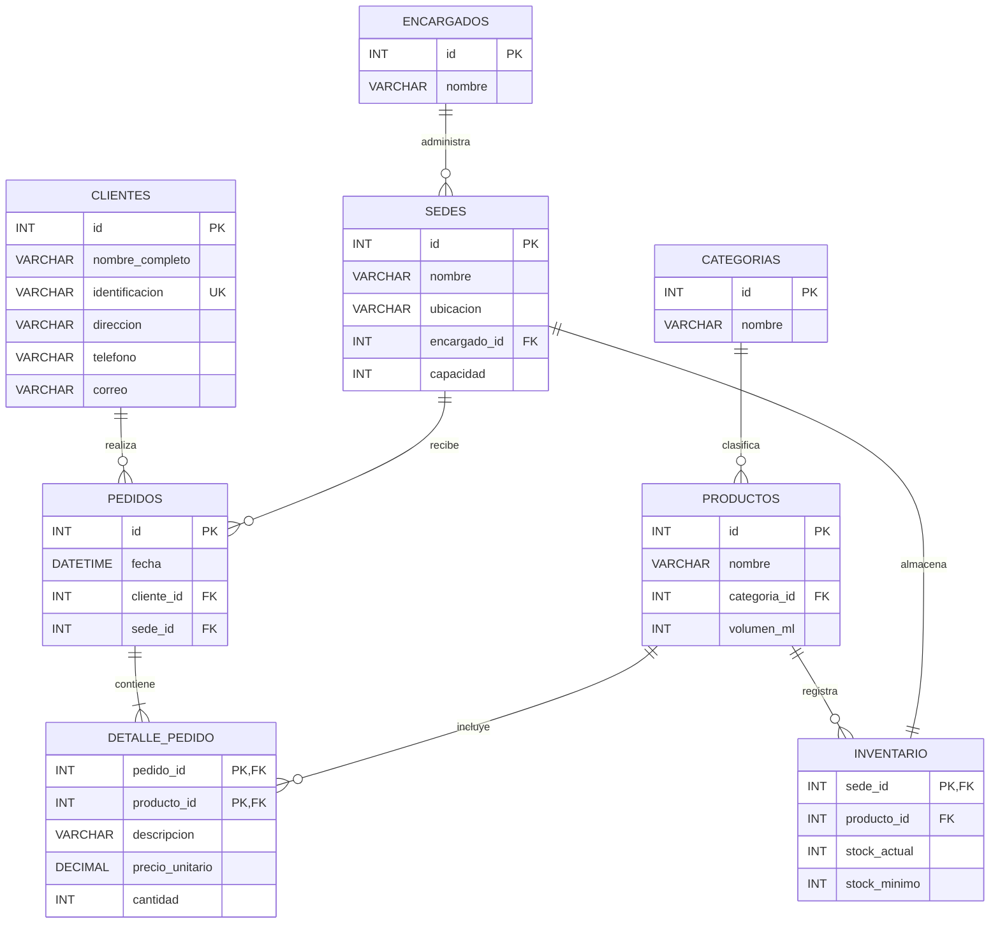

# Requerimientos y análisis de entidades

## 1. Descripción general

El sistema **Distribuidora** representa la gestión de clientes, productos, categorías, pedidos, sedes e inventario.

El modelo parte de una relación inicial que concentraba información de diferentes entidades. Mediante el proceso de normalización se separaron los datos hasta obtener un modelo en **Tercera Forma Normal (3FN)**.

El diseño utiliza claves primarias y foráneas para relacionar las entidades y reducir la duplicación de información.

---

## 2. Entidades del sistema

### Tabla: `clientes`

Almacena la información de los clientes.

| Campo | Tipo de dato | Restricciones | Descripción |
| --- | --- | --- | --- |
| `id` | INT | PK, AUTO_INCREMENT | Identificador único del cliente. |
| `nombre_completo` | VARCHAR(150) | NOT NULL | Nombre completo del cliente. |
| `identificacion` | VARCHAR(30) | NOT NULL, UNIQUE | Identificación única del cliente. |
| `direccion` | VARCHAR(200) | NOT NULL | Dirección del cliente. |
| `telefono` | VARCHAR(30) | NOT NULL | Teléfono del cliente. |
| `correo` | VARCHAR(150) | NOT NULL | Correo electrónico del cliente. |

### Tabla: `categorias`

Define las categorías de los productos.

| Campo | Tipo de dato | Restricciones | Descripción |
| --- | --- | --- | --- |
| `id` | INT | PK, AUTO_INCREMENT | Identificador único de la categoría. |
| `nombre` | VARCHAR(100) | NOT NULL | Nombre de la categoría. |

### Tabla: `productos`

Contiene la información propia de cada producto.

| Campo | Tipo de dato | Restricciones | Descripción |
| --- | --- | --- | --- |
| `id` | INT | PK, AUTO_INCREMENT | Identificador único del producto. |
| `nombre` | VARCHAR(150) | NOT NULL | Nombre del producto. |
| `categoria_id` | INT | NOT NULL, FK | Categoría a la que pertenece el producto. |
| `volumen_ml` | INT | NOT NULL, CHECK > 0 | Volumen del producto en mililitros. |

### Tabla: `encargados`

Registra los encargados de las sedes.

| Campo | Tipo de dato | Restricciones | Descripción |
| --- | --- | --- | --- |
| `id` | INT | PK, AUTO_INCREMENT | Identificador único del encargado. |
| `nombre` | VARCHAR(150) | NOT NULL | Nombre del encargado. |

### Tabla: `sedes`

Representa las sedes de la distribuidora.

| Campo | Tipo de dato | Restricciones | Descripción |
| --- | --- | --- | --- |
| `id` | INT | PK, AUTO_INCREMENT | Identificador único de la sede. |
| `nombre` | VARCHAR(100) | NOT NULL | Nombre de la sede. |
| `ubicacion` | VARCHAR(200) | NOT NULL | Ubicación de la sede. |
| `encargado_id` | INT | NOT NULL, FK | Encargado de la sede. |
| `capacidad` | INT | NOT NULL, CHECK > 0 | Capacidad disponible de la sede. |

### Tabla: `inventario`

Relaciona los productos con las sedes y controla las existencias.

| Campo | Tipo de dato | Restricciones | Descripción |
| --- | --- | --- | --- |
| `sede_id` | INT | PK, NOT NULL, FK | Sede donde se encuentra el registro de inventario. |
| `producto_id` | INT | NOT NULL, FK | Producto registrado en el inventario. |
| `stock_actual` | INT | NOT NULL, DEFAULT 0, CHECK >= 0 | Existencia actual del producto en la sede. |
| `stock_minimo` | INT | NOT NULL, DEFAULT 0, CHECK >= 0 | Existencia mínima establecida para el producto. |

La clave primaria actual es:

```text
sede_id
````

El registro de inventario se encuentra asociado a una sede mediante:

```text
sede_id -> sedes.id
```

El producto registrado en el inventario se relaciona mediante:

```text
producto_id -> productos.id
```

### Tabla: `pedidos`

Representa la información general de cada pedido.

| Campo        | Tipo de dato | Restricciones                       | Descripción                     |
| ------------ | ------------ | ----------------------------------- | ------------------------------- |
| `id`         | INT          | PK, AUTO_INCREMENT                  | Identificador único del pedido. |
| `fecha`      | DATETIME     | NOT NULL, DEFAULT CURRENT_TIMESTAMP | Fecha y hora del pedido.        |
| `cliente_id` | INT          | NOT NULL, FK                        | Cliente que realiza el pedido.  |
| `sede_id`    | INT          | NOT NULL, FK                        | Sede asociada al pedido.        |

Un cliente puede realizar múltiples pedidos, por lo que la relación entre `clientes` y `pedidos` es de tipo **1 : N**.

El total del pedido puede obtenerse a partir de los detalles, por lo que `total_pedido_sin_iva` se considera un valor calculado y no es necesario almacenarlo directamente.

### Tabla: `detalle_pedido`

Representa los productos incluidos dentro de cada pedido.

| Campo             | Tipo de dato  | Restricciones        | Descripción                                      |
| ----------------- | ------------- | -------------------- | ------------------------------------------------ |
| `pedido_id`       | INT           | PK, FK               | Pedido al que pertenece el detalle.              |
| `producto_id`     | INT           | PK, FK               | Producto incluido en el pedido.                  |
| `descripcion`     | VARCHAR(255)  | NOT NULL             | Descripción relacionada con la línea del pedido. |
| `precio_unitario` | DECIMAL(10,2) | NOT NULL, CHECK >= 0 | Precio aplicado al producto en el pedido.        |
| `cantidad`        | INT           | NOT NULL, CHECK > 0  | Cantidad solicitada.                             |

La clave primaria es compuesta:

```text
pedido_id + producto_id
```

El subtotal de cada línea puede obtenerse mediante:

```text
precio_unitario * cantidad
```

por lo que `subtotal_linea` se considera un valor calculado.

---

## 3. Relaciones

| Tabla padre  | Tabla hija       | Cardinalidad | Clave foránea                |
| ------------ | ---------------- | ------------ | ---------------------------- |
| `clientes`   | `pedidos`        | 1 : N        | `pedidos.cliente_id`         |
| `sedes`      | `pedidos`        | 1 : N        | `pedidos.sede_id`            |
| `pedidos`    | `detalle_pedido` | 1 : N        | `detalle_pedido.pedido_id`   |
| `productos`  | `detalle_pedido` | 1 : N        | `detalle_pedido.producto_id` |
| `categorias` | `productos`      | 1 : N        | `productos.categoria_id`     |
| `productos`  | `inventario`     | 1 : N        | `inventario.producto_id`     |
| `sedes`      | `inventario`     | 1 : 1        | `inventario.sede_id`         |
| `encargados` | `sedes`          | 1 : N        | `sedes.encargado_id`         |

---

## 4. Diagrama del modelo normalizado



---

## 5. Normalización

### Primera Forma Normal (1FN)

La relación inicial contenía información de clientes, productos, pedidos, sedes e inventario dentro de una misma estructura.

Los atributos fueron identificados y organizados para poder separar posteriormente las entidades.

### Segunda Forma Normal (2FN)

Se eliminaron las dependencias parciales.

La información propia de cada entidad se separó de los datos que dependen de una combinación de claves.

En `detalle_pedido`, por ejemplo, los datos propios de una línea dependen de:

```text
pedido_id + producto_id
```

### Tercera Forma Normal (3FN)

Se eliminaron las dependencias transitivas.

Por ejemplo:

```text
PRODUCTOS
    └── categoria_id

CATEGORIAS
    └── nombre
```

De esta forma, el nombre de la categoría no necesita repetirse dentro de cada producto.

También se separó la información de los encargados de las sedes:

```text
SEDES
    └── encargado_id

ENCARGADOS
    └── nombre
```

---

## 6. Distribución de los campos originales

La relación inicial `pedidos` contenía los siguientes campos:

| Campo original         | Ubicación después de la normalización  |
| ---------------------- | -------------------------------------- |
| `id_pedido`            | `pedidos.id`                           |
| `id_producto`          | `detalle_pedido.producto_id`           |
| `id_cliente`           | `pedidos.cliente_id`                   |
| `id_sede`              | `pedidos.sede_id`                      |
| `detalles_pedido`      | `detalle_pedido.descripcion`           |
| `precio_unitario`      | `detalle_pedido.precio_unitario`       |
| `stock_actual`         | `inventario.stock_actual`              |
| `stock_minimo`         | `inventario.stock_minimo`              |
| `cantidad_pedida`      | `detalle_pedido.cantidad`              |
| `subtotal_linea`       | Calculado en `detalle_pedido`          |
| `total_pedido_sin_iva` | Calculado a partir de `detalle_pedido` |

Esta distribución permite conservar la información original sin mantener todos los campos dentro de una sola tabla.

---

## 7. Valores calculados

Algunos valores de la relación original pueden obtenerse a partir de otros datos.

### Subtotal de la línea

```text
subtotal_linea =
precio_unitario * cantidad
```

El resultado depende de los datos de `detalle_pedido`.

### Total del pedido

```text
total_pedido_sin_iva =
SUM(subtotal_linea)
```

El total depende de todas las líneas asociadas al pedido.

Por esta razón, ambos valores pueden calcularse mediante consultas y no necesitan almacenarse físicamente.

---

## 8. Reglas principales

* Todos los identificadores utilizan `INT`.
* Las claves foráneas utilizan el mismo tipo de dato que sus claves primarias.
* `identificacion` debe ser única.
* Cada producto pertenece a una categoría.
* Cada sede tiene un encargado.
* Cada pedido pertenece a un cliente y a una sede.
* Un cliente puede realizar múltiples pedidos.
* Cada pedido puede contener múltiples productos mediante `detalle_pedido`.
* Un producto puede aparecer en múltiples pedidos.
* La combinación `pedido_id + producto_id` identifica de forma única cada detalle de pedido.
* `stock_actual` y `stock_minimo` pertenecen a `inventario`.
* `descripcion`, `precio_unitario` y `cantidad` pertenecen a `detalle_pedido`.
* El precio unitario se conserva en `detalle_pedido` porque representa el precio aplicado en ese pedido.
* Los subtotales y totales pueden calcularse a partir de los datos almacenados.
* Los datos del cliente no se repiten dentro de cada pedido.
* Los datos descriptivos del producto no se repiten dentro de cada detalle.

---

## 9. Tipos de datos principales

### Identificadores

```sql
INT
```

Se utiliza para las claves primarias y foráneas.

No se utilizan identificadores como:

```text
CLI-001
PROD-101
PED-001
SED-01
```

como claves físicas de la base de datos.

### Valores monetarios

```sql
DECIMAL(10,2)
```

Se utiliza para `precio_unitario`.

### Valores numéricos

```sql
INT
```

Se utiliza para cantidades, volumen, capacidad y existencias.

### Texto

```sql
VARCHAR
```

Se utiliza para nombres, direcciones, correos, identificaciones y descripciones.

### Fecha

```sql
DATETIME
```

Se utiliza para registrar la fecha y hora de los pedidos.

---

## 10. Resultado final

El modelo normalizado está compuesto por:

```text
clientes
categorias
productos
encargados
sedes
inventario
pedidos
detalle_pedido
```

Los campos de la relación original no se eliminan, sino que se distribuyen entre las entidades correspondientes según sus dependencias.

El resultado permite mantener separados los datos de clientes, productos, pedidos, detalles e inventario, reduciendo la redundancia y evitando dependencias parciales y transitivas.

El modelo cumple conceptualmente con la **Tercera Forma Normal (3FN)**.
